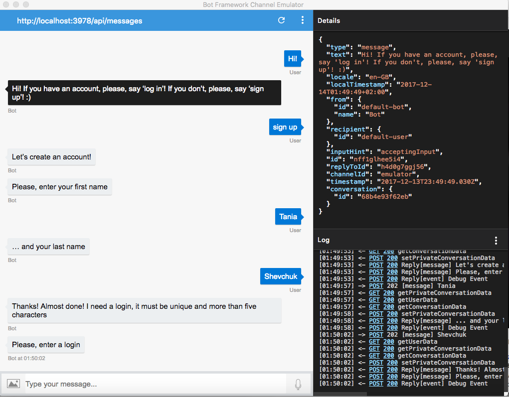
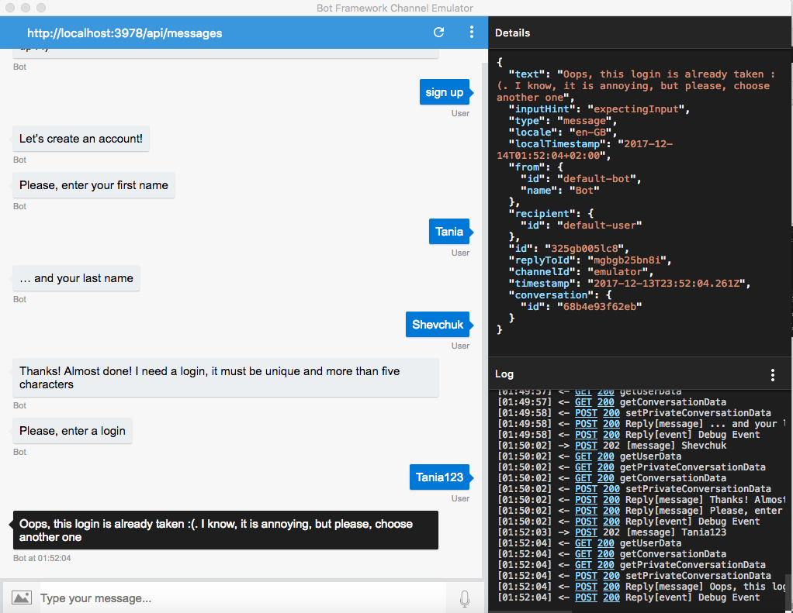
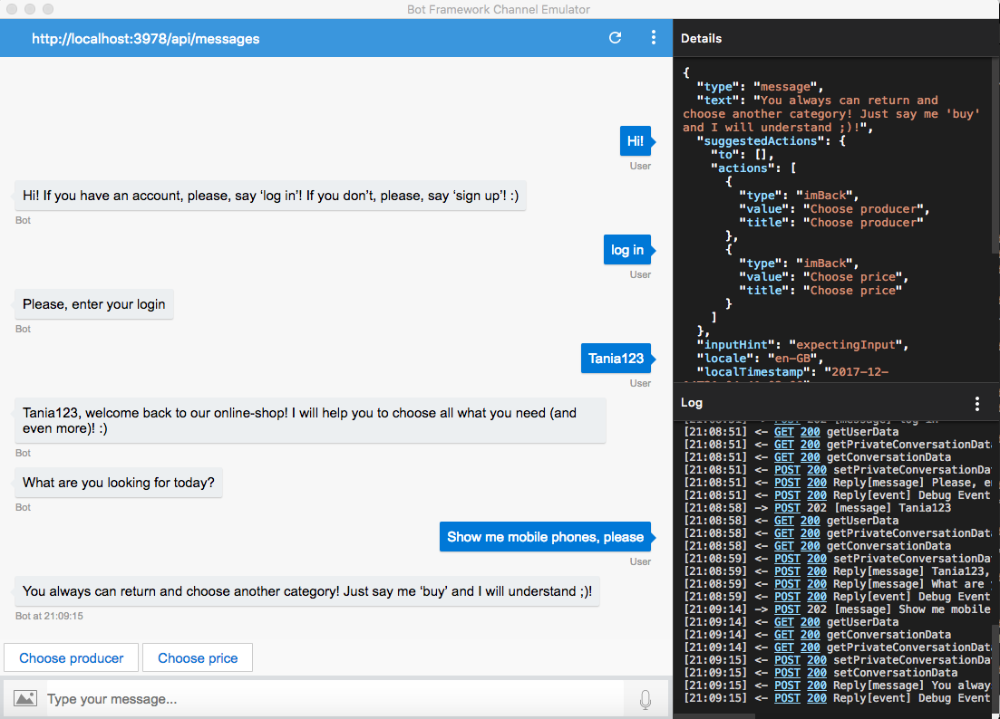
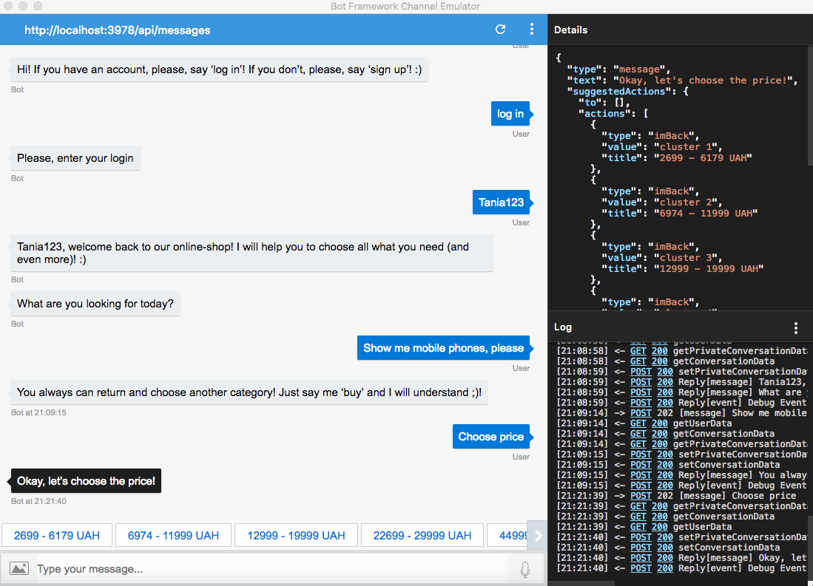
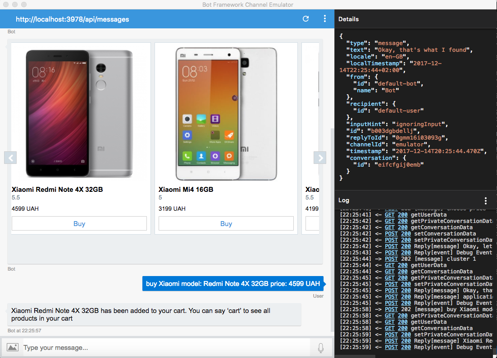
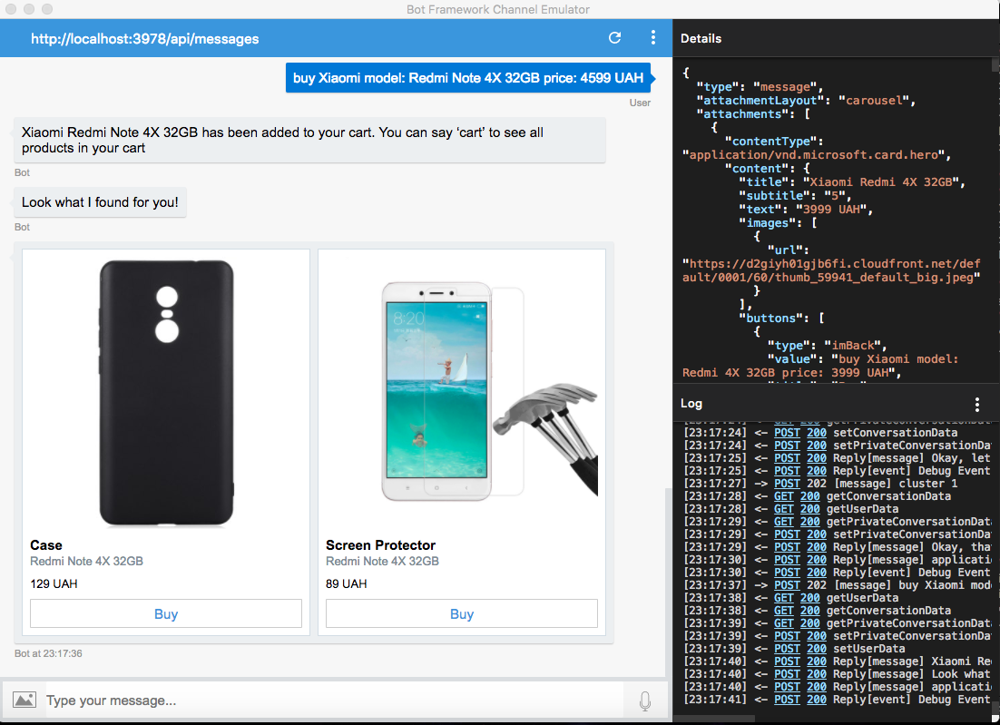
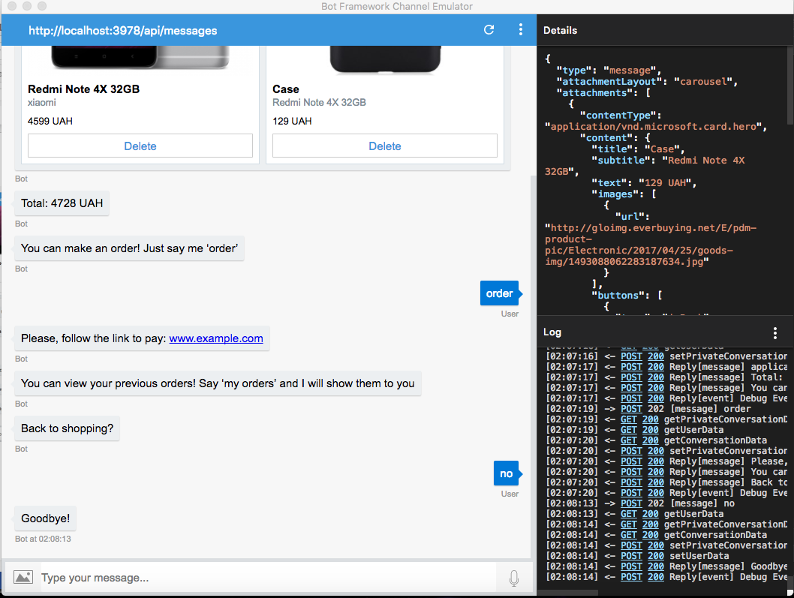

# E-commerce-bot

My little project (my attempts to do smth in Node.js with MS Bot Framework) for graduation qualification work.

Theme of graduation work is "Recommender systems in e-commerce".

